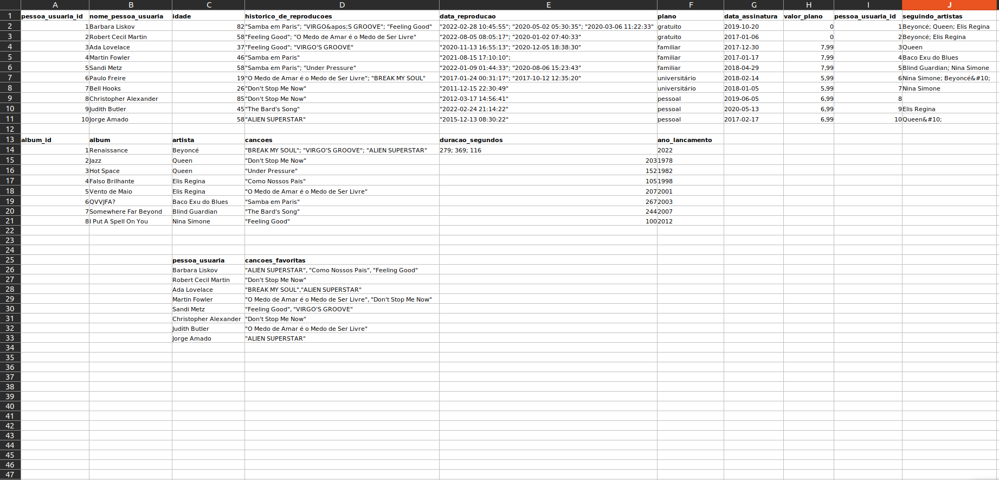
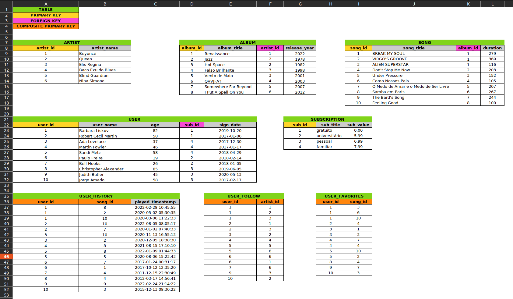
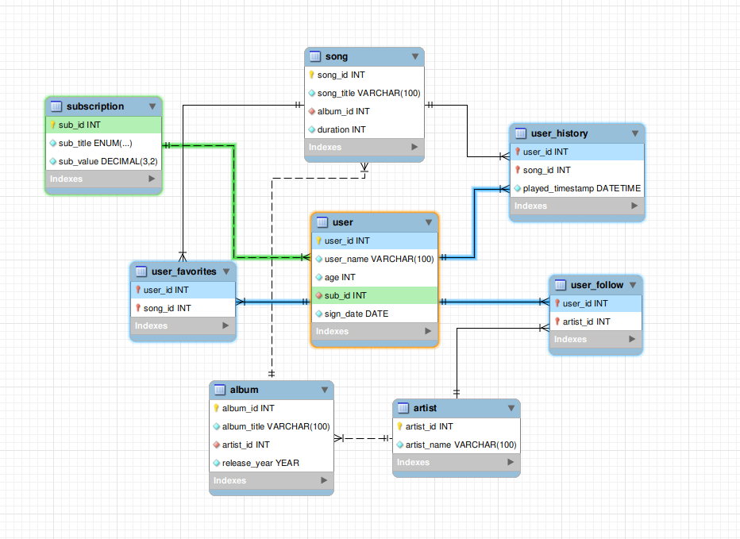

O projeto foi criado para colocar em prática funções SQL, JOINS e Normalização de banco de dados. Para isso foi utilizado o banco de dados fictício `SpotifyClone` com tabelas não normalizadas.

## 🧑‍💻 Habilidades Desenvolvidas

  * Modelar um banco de dados

  * Identificar entidades, atributos e relacionamentos
  
  * Aplicar a 1ª, 2ª e 3ª Forma Normal

  * Criar tabelas

  * Inserir dados nas tabelas

  * Alterar tabelas

  * Consultar dados das tabelas

---

## 📌 Problema apresentado

Foi recebida uma planilha não normalizada com informações sobre pessoas usuárias de um serviço de streaming de músicas. O trabalho consistiu em duas partes:

1. Normalizar essa tabela, modelar e criar o schema no banco de dados local e populá-lo;

2. Realizar os desafios no banco normalizado e populado.

### 🆘 Planilha com tabelas não normalizadas

___
### ✅ Planilhas após normalização e modelagem

Para tanto foi utilizado código de cores, de modo a facilitar a visualização das tabelas e suas relações.

___
### 📈 Diagrama Entidade Relacionamento

___
# 🏁 Desafios Cumpridos

Após a normalização e modelagem do banco de dados, foi criada uma `QUERY` para cada desafio proposto, conforme melhor explicitado nos comentários dos arquivos `.sql` da pasta `challenges`.

---
## Tecnologias usadas

> Desenvolvido usando: MYSQL
